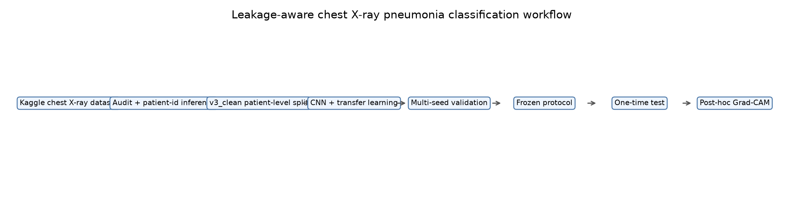
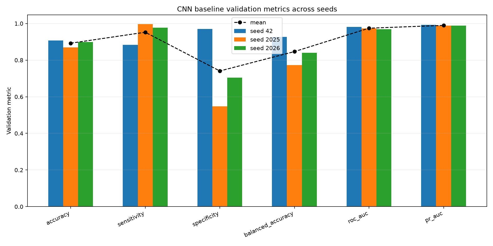
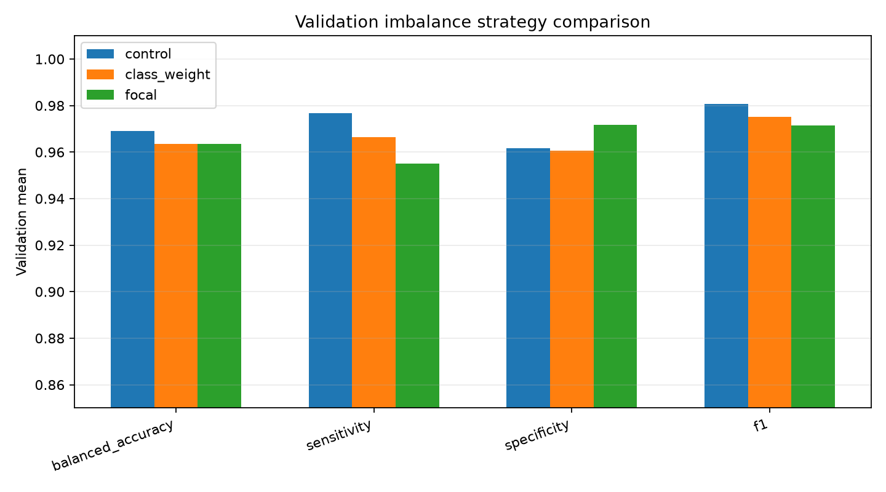
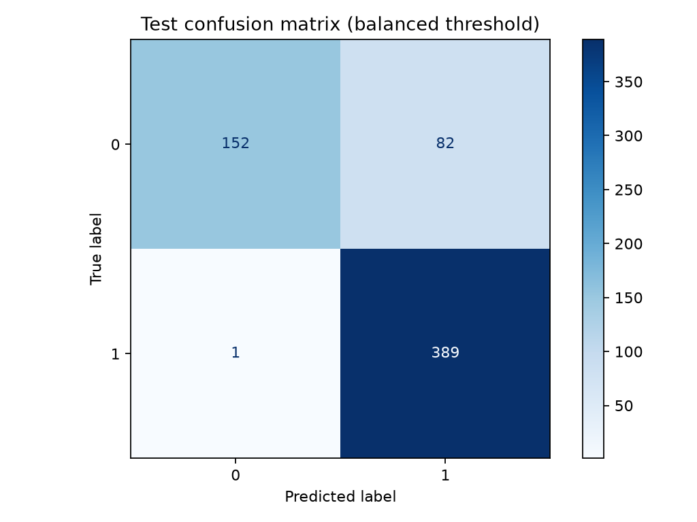
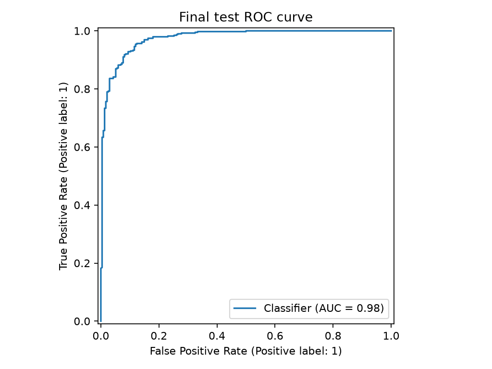
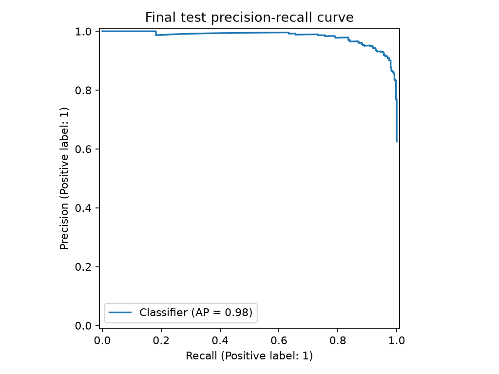
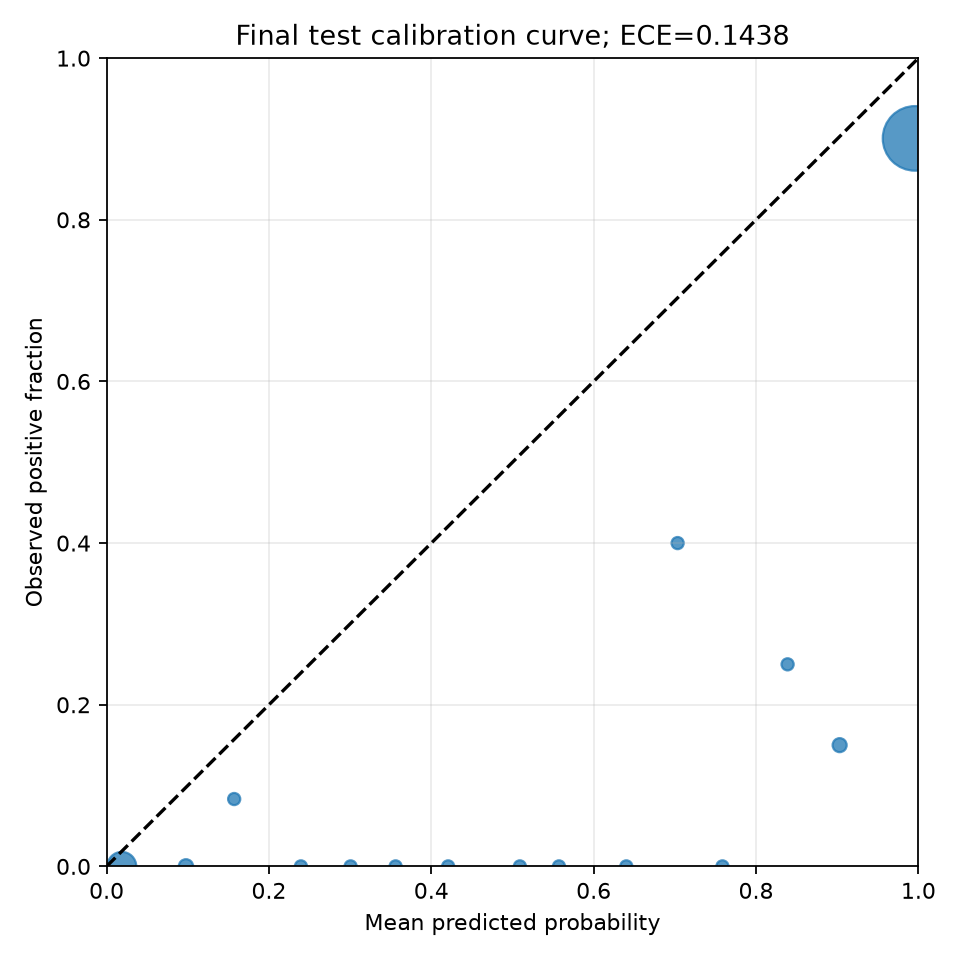
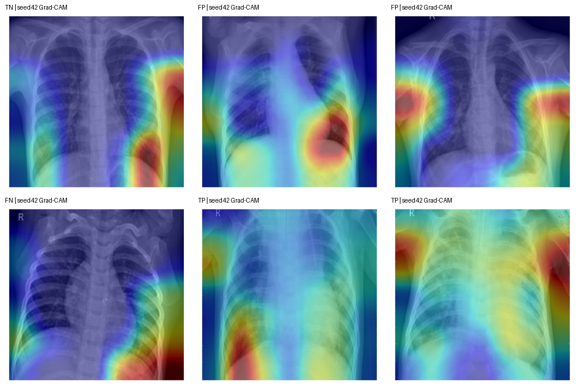

# chest-xray-pneumonia-classification


A reproducible and leakage-aware deep learning study for pediatric chest X-ray pneumonia classification, including patient-level splitting, multi-seed evaluation, frozen test protocol, calibration analysis, and post-hoc explainability.

This is a research and education project. It is not a medical device and must not be used for clinical diagnosis or triage.

## Core question

How much of a strong validation result survives a leakage-aware protocol, multi-seed validation, frozen model selection, and one-time final test evaluation?

## Key result snapshot

The headline is not simply validation accuracy. The final test set showed a meaningful generalization gap, especially lower specificity and worse calibration.

| stage | operating point | accuracy | sensitivity | specificity | balanced accuracy | ROC-AUC | PR-AUC | Brier |
| --- | --- | ---: | ---: | ---: | ---: | ---: | ---: | ---: |
| validation | EfficientNetB0 control ensemble, threshold 0.5 | 0.9738 | 0.9766 | 0.9667 | 0.9716 | 0.9967 | 0.9988 | 0.0201 |
| frozen official test | primary threshold 0.5618644667 | 0.8670 | 0.9974 | 0.6496 | 0.8235 | 0.9751 | 0.9829 | 0.1197 |

## Workflow



## Data

The project uses the Kaggle dataset `paultimothymooney/chest-xray-pneumonia`. Raw images are not included in this repository. Patient IDs are inferred from filenames, which is a limitation.

See [docs/DATASET.md](docs/DATASET.md).

## Leakage control

The official validation split has only 16 images, so the project builds a v3_clean development split. Development images with inferred patient IDs overlapping the official test set are excluded before train/validation splitting.

## Experiments

- CNN baseline, three seeds
- VGG16 transfer learning
- EfficientNetB0 transfer learning
- EfficientNetB0 multi-seed validation
- Class weighting and focal loss ablations
- Frozen ensemble, calibration, and threshold selection
- One-time final test
- Post-hoc error analysis and Grad-CAM




## Final test and errors

At the primary frozen threshold, test confusion counts were TN=152, FP=82, FN=1, TP=389. The main error mode was false positives; 53 FP cases were high-confidence by the fixed post-hoc definition.






## Explainability

Grad-CAM examples are post-hoc exploratory visualizations from the seed 42 model only. They do not explain the full ensemble and do not prove medical causality.



## Project structure

```text
configs/     experiment and data configuration
src/         data audit, splitting, training, aggregation, protocol, and analysis code
scripts/     environment, run, and validation scripts
tests/       synthetic and unit tests
docs/        public documentation
reports/     public Markdown reports
```

## Environment

Use Python 3.11. TensorFlow 2.21 was used in the original WSL2 environment.

```bash
python3.11 -m venv .venv
source .venv/bin/activate
python -m pip install --upgrade pip setuptools wheel
python -m pip install -r requirements.txt
```

## Data preparation

```bash
kaggle datasets download -d paultimothymooney/chest-xray-pneumonia
python src/create_splits_v3_clean.py --help
python src/check_data_pipeline.py --help
```

Real manifests are generated locally and are not committed.

## Reproducibility commands

```bash
python -m pytest -q
python src/train_cnn.py --help
python src/train_transfer.py --help
python src/aggregate_transfer_multiseed.py --help
```

The original final test was protected by a one-time evaluation protocol. Do not use test results to change thresholds, calibration, or model choice.

## Documentation

- [Dataset](docs/DATASET.md)
- [Experiment protocol](docs/EXPERIMENT_PROTOCOL.md)
- [Results](docs/RESULTS.md)
- [Model card](docs/MODEL_CARD.md)
- [Limitations](docs/LIMITATIONS.md)
- [Ethics and safety](docs/ETHICS_AND_SAFETY.md)
- [Reproducibility](docs/REPRODUCIBILITY.md)

## Citation

See [CITATION.cff](CITATION.cff).

## License

The original code and documentation in this repository are released under the MIT License. Chest X-ray images are not distributed here and remain governed by the data provider's terms. ImageNet pretrained weights and third-party dependencies follow their respective licenses. Model weights are not distributed. The MIT License does not authorize clinical use or imply medical-device certification.

## 中文概述

本项目是一个儿童胸片肺炎分类的研究/教学项目，重点在于患者级划分、防止数据泄漏、多随机种子验证、冻结协议和一次性最终测试。模型不能用于临床诊断或分诊。
